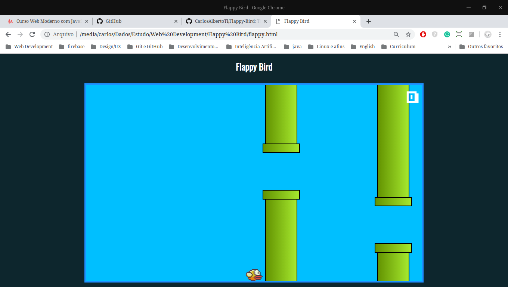

# The Flappy Bird Game

## Made using JS

### The file flappy.js contains how the game works
#### It´s split into nine functions:
- novoElemento: Responsible for creating a Dom element and add a class in this element.
- Barrira: Responsible for creating an obstacle on the game. 
- ParDeBarreiras: Responsible for creating a couple of obstacles in the game.
- Barreiras: Responsible for creating all the obstacles.
- Passaro: Responsible for creating the bird that the player will control and define his position.
- Progresso: Responsible for update the points and start counting with 0.
- estaoSobrepostos: Responsible for checking if the bird hits the obstacle.
- colidiu: Use the estaoSobrepostos function to check all possibilities of hits.
- Flappy Birds: In this function, the game will start and will control all the game´s functions. 
### The flappy.css contains all the styles for all the game necessary components 
